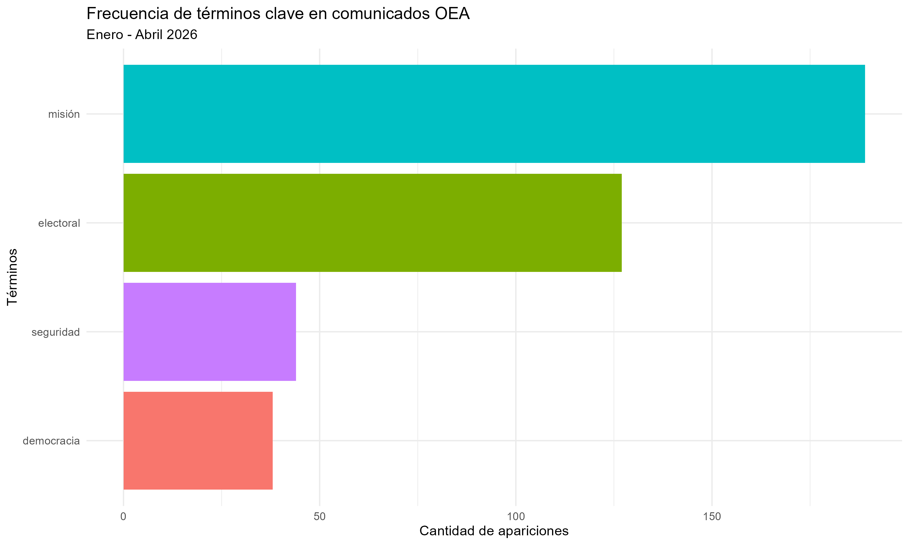

# Trabajo Practico 2

### Introducción del trabajo

Para el TP loq ue hice fue usar herramientas de ciencias de datos para poder entender como funciona la comunicacion de los organismos internacionales (en particular la OEA). Para esto, examiné el total de comunicados de la OEA del primer cuatrimestre de 2026.

### **Pregunta de Investigación**

La pregunta en la cual me basé fue: ¿Es la OEA una org monotematica centrada en lo electoral, o su agenda refleja una verdadera preocupación por la seguridad y los DDHH? Todo esto dentro del periodo enero 2026 a abril 2026

### Código

```{r}
library(here)

# Corro todo el proceso:
source(here("TP2/scripts/scraping_oea.R")) 
source(here("TP2/scripts/processing.R")) 
source(here("TP2/scripts/metrics_figures.R"))
```

### Explicación de los scripts

**1. Scraping**

<div>

En este archivo hice la recolección de los datos directamente de la pagina de la OEA. Pra poder hacerlo, dividi el codigo de la siguiente forma:

-   *Preparación del entorno*: Primero, el script verifica si existe la carpeta `/data` dentro de la estructura del proyecto. Si no está, la crea automáticamente usando la librería `here` para chequear que las rutas funcionen en todas las computadoras
-   *Configuración de la busqueda*: definí los parametros para usar solo los comunicados del primer cuatrimeste (enero a abril) del 2026
-   *Exploración de datos*: el codigo va mes por mes y descarga la lista de noticias. Guarde cada una de estas paginas como un archivo `.html` con la fecha del dia, para que quede un registro
-   *Extracción de los datos*: Una vez que tuve los links (con `.headlinelink` ), el script entra a cada comunicado de forma individual. Acá extrae tres datos:
    -   ID
    -   Titulo
    -   Cuerpo del texto
-   Programe un tiempo de espera de 5 segundos entre la descarga de cada noticia, así evito la sobrecarga del servidor
-   *Tabla*: Por ultimo, todos los comunicados bajados se agrupan en una tabla y se guardan en el archivo `comunicados_oea.rds`

</div>

2.  **Processing**

<div>

Una vez que tuve los comunicados descargados, limpié el contenido para quedarme solo con las palabras que realmente aportan significado a la agenda política

-   *Carga y limpieza inicial***:** Importé el archivo `.rds` generado en la etapa anterior. Lo primero fue pasar todo el texto a minúsculas y eliminar cualquier elemento que no fuera una palabra, como signos de puntuación, números o espacios extra.

    -   Esto asegura que, por ejemplo, "Derechos" y "derechos" se cuenten como lo mismo

-   *Lematización*: Usé un modelo de lenguaje en español para reducir cada palabra a su raíz (lema). Asi, verbos conjugados como "organización" o sustantivos como "misiones" se transformaban en "organizar" o "misión"

-   *Filtro por categorías gramaticales*: Para que el análisis fuera preciso, filtré los datos para conservar únicamente sustantivos, verbos y adjetivos. Al eliminar conjunciones o preposiciones, logré que los resultados finales reflejen temas concretos y acciones

-   *Uso de Stopwords***:** Eliminé las "palabras vacías" (como "un", "con", "para") que aparecen con mucha frecuencia pero no definen la agenda de un organismo internacional

-   *Exportación de los datos limpio*s: el resultado de esto lo guardé en una tabla em la carpeta `/output` con el nombre `processed_text.rds`

</div>

3.  **Script de metricas y graficos**

<div>

En el ultimo script genere un grafico con el resultado del analisis

-   *Selección de términos*: Definí 5 términos clave que representan los pilares institucionales de la OEA: **democracia, electoral, misión, derechos y seguridad**

-   *Cálculo de frecuencias*: El script busca estos términos dentro de la base de datos ya lematizada y cuenta cuántas veces aparece cada uno en el total de los comunicados del cuatrimestre.

-   *Generación del gráfico*: Usando la librería `ggplot2`, creé un gráfico de barras horizontales (para facilitar la lectura de los términos) que muestra el volumen de menciones de cada palabra.

-   *Guardado final*: Finalmente, el código exporta automáticamente el gráfico como una imagen `.png` de alta resolución a la carpeta `/output`

</div>

### Analisis de los resultados

Al mirar los resultados, la palabra que más salió, por lejos, fue **"misión"**, seguida de cerca por **"electoral"**. Esto tiene lógica si pensamos en el rol que cumple la OEA en la región: la mayor parte de su comunicación hoy está concentrada en el despliegue de las Misiones de Observación Electoral. Básicamente, su agenda pública está muy volcada a la parte operativa y de monitoreo en el terreno.

Por otro lado, **"seguridad"** y **"democracia"** aparecieron mucho menos que las dos primeras. Esto me llamó la atención porque, aunque son pilares de la organización, parecen tener menos peso en el "día a día" de los comunicados de prensa de este cuatrimestre. Da la sensación de que la OEA hoy comunica más sus acciones concretas (las misiones) que los conceptos teóricos o debates sobre seguridad.



### Conclusiones

Hacer este TP me sirvió para sacarme una duda: ¿de qué habla realmente la OEA hoy? Gracias a los datos, me quedó claro que la organización está muy metida en lo **electoral y en el trabajo de sus misiones**.

Antes de empezar, pensaba que quizás la seguridad o los derechos humanos aparecían más seguido, pero el gráfico me mostró que esos temas hoy quedan en un segundo plano. Lo mejor de haber usado estos scripts es que no tuve que perder horas leyendo noticia por noticia; pude analizar meses de información en un ratito y ver la realidad de forma objetiva.
